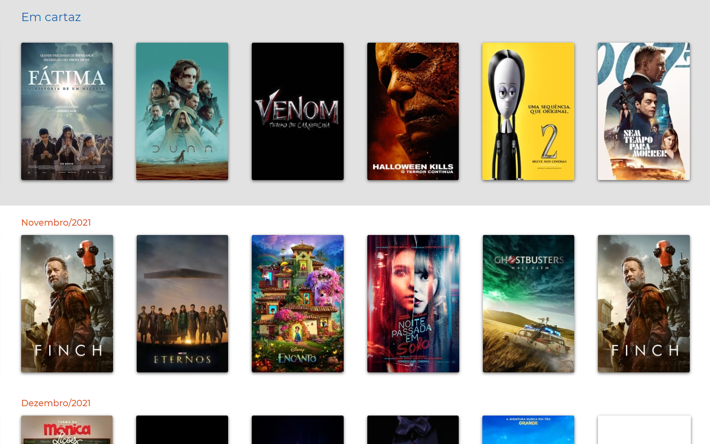
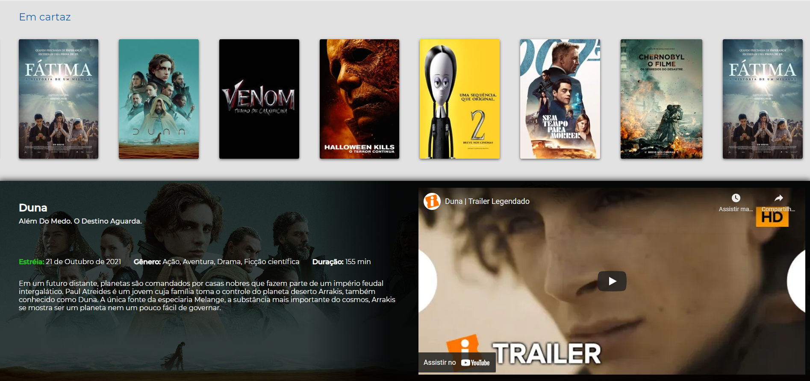

# Front-end

Sua tarefa é construir um site simples para listar filmes que estão em cartaz utilizando a API do [TMDB](https://www.themoviedb.org/).

O website deverá ser construído utilizando React17 e a estilização SASS, LESS ou [styled-components](https://styled-components.com/).

## O que será avaliado

Queremos avaliar sua capacidade de construção de um protótipo simples sem necessariamente precisar da especificação completa de um layout, algo que fazemos muito para fins de validação antes da definição completa do sistema. Serão avaliados:

- Código bem escrito e limpo;
- Organização estrutural do projeto
- Quais ferramentas foram usadas, como e por quê, além do seu conhecimento das mesmas;
- Seu conhecimento requisições HTTP, APIs REST, etc;
- Sua capacidade de se comprometer com o que foi fornecido;
- Sua capacidade de buscar e entender documentação de APIs terceiras ([veja a documentação do TMDB aqui](https://developers.themoviedb.org/3));

## O mínimo necessário

- Uma página responsiva, sem autenticação, contendo a exibição correta dos filmes em português, datas de estreia, trailer, etc; que atenda os requisitos descritos abaixo;
- README.md contendo informações básicas do projeto e como executá-lo;

## Bônus

Os seguintes itens não são obrigatórios, mas darão mais valor ao seu trabalho (os em negrito são mais significativos para nós)

- Uso de ferramentas externas que facilitem o seu trabalho;
- Cuidados especiais com otimização, padrões, entre outros;
- Construir o layout inspirado ao que foi apresentado sem ser uma cópia exata;
- **Testes**;
- **Utilização correta do styled-components, SASS ou LESS**
- **Conteinerização da aplicação**;

# Requisitos

## 1) Deve conter a lista de filmes com as imagens das capas

## 2) Deve ser possível ver informações do filme ao clicar em cima, como data de lançamento, descrição e trailer

# Critérios de Aceitação

- Todos os requisitos acima devem ser cumpridos, seguindo o padrão de rotas estabelecido;
- O layout deve ser semelhante ou inspirado ao que apresentado nas imagens

Ao término do desafio, você deve enviar o link do seu repositório [GitHub](https://github.com/) no formulário de resposta.
